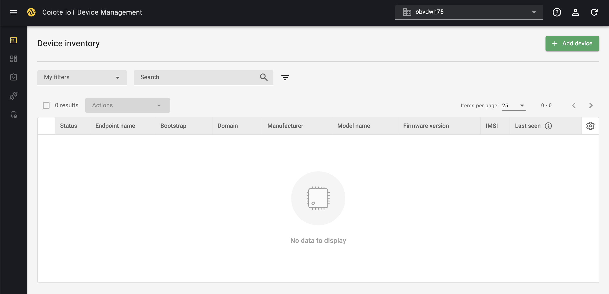
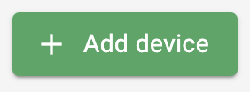
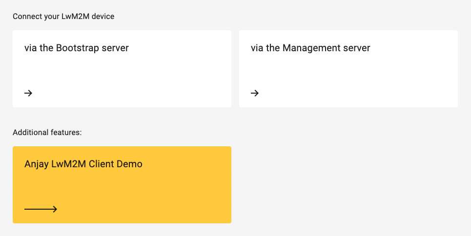
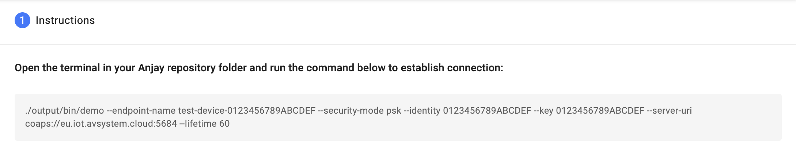
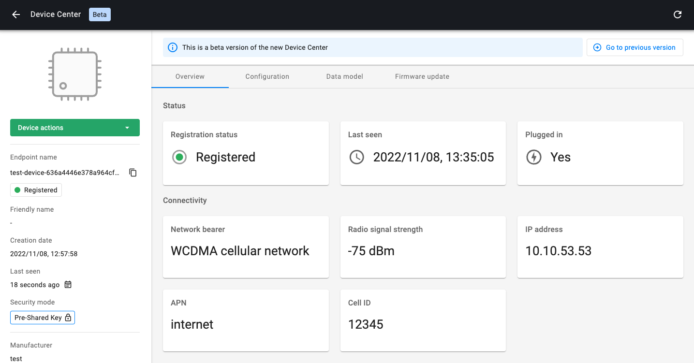
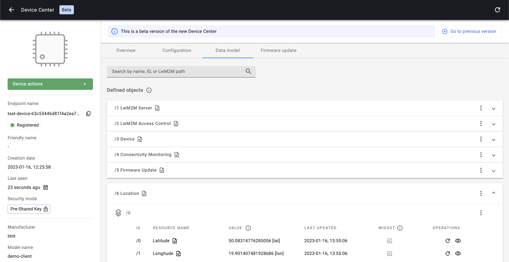

# Quick Start

## Welcome to the DevZone of AVSystem!

This Quick Start walks you through the process of building your first LwM2M application using AVSystem’s LwM2M Client **Anjay** and AVSystem’s LwM2M Server **{{ coiote_long_name }}**.

Follow this guide to build your first LwM2M application using a simulated device within 20 minutes.

<iframe width="640" height="360" src="https://www.youtube.com/embed/m-9zYqV5bLQ" title="AVSystem Quickstart" frameborder="0" allow="accelerometer; autoplay; clipboard-write; encrypted-media; gyroscope; picture-in-picture; web-share" allowfullscreen></iframe>

## Access the {{ coiote_short_name }} portal

Get started by <a href="{{ coiote_site_link }}" target="_blank">**signing up**</a> to {{ coiote_long_name }}. You can sign up for a developer account, which allows you to connect up to 10 devices free of charge.

[{{ coiote_short_name }}]({{ coiote_site_link }}){: .md-button .md-button--big }

## Run Anjay LwM2M Client Demo

Anjay LwM2M SDK is a set of tools that enables device vendors and IoT developers to easily implement a LwM2M client on their hardware. It is available both in an advanced commercial version and in the open-source model, you can find it on <a href="https://github.com/AVSystem/Anjay" target="_blank">GitHub</a>.

Start by running the Anjay client on your **Linux**, **Mac** or **Windows** machine and simulate LwM2M telemetry data.
Try [Anjay demo client](https://github.com/AVSystem/Anjay?tab=readme-ov-file#running-the-demo-client) to onboard your first simulated device.

!!! note
    If preferred, you can directly jump to the Getting Started guides of the popular hardware platforms:

    * [Nordic](./LwM2M_Client/Nordic/Thingy91.md)
    * [STMicroelectronics](./LwM2M_Client/STMicroelectronics/Building_LwM2M_applications/Building_LwM2M_applications_with_I-CUBE-Anjay.md)
    * [ESP32](./LwM2M_Client/ESP32/ESP32-DevKitCBG96.md)
    * [Raspberry Pi Pico W](./LwM2M_Client/RaspberryPi/RaspberryPi-Pico-W.md)

!!! Info
    For more information about the Anjay LwM2M Client, visit the <a href="https://avsystem.github.io/Anjay-doc/index.html" target="_blank">**Anjay Library Documentation**</a>.

## Add a new device in {{ coiote_short_name }}

After compiling the demo project, go back to the [{{ coiote_short_name }} portal]({{ coiote_site_link }}/).

Click **+ Add device** in the top-right corner.

Add a new device using the option: **Anjay LwM2M Client Demo**

Copy the command you find in {{ coiote_short_name }}.

Go back to your terminal, open your Anjay directory and **run the command** to configure and activate the demo application.

## Monitor your demo device in the {{ coiote_short_name }}

If the demo application started successfully, a device is shown in the{{ coiote_short_name }}platform.

### Review the Data model

Go to the **Data model** tab in the top-menu.

Under Data model you will find all the configured LwM2M **Objects**, **Object instances** and **Resources** containing property values or telemetry data. This includes:

- Object `/1 LwM2M`
    - Resource `/0 Short Server ID`
    - Resource `/1 Lifetime`
    - Etc.
- Object `/3 Device`
    - Resource `/0 Manufacturer`
    - Resource `/1 Modem Number`
    - Resource `/2 Serial Number`
    - Etc.
- Object `/6 Location`
    - Resource `/0 Latitude`
    - Resource `/1 Longitude`
    - Resource `/2 Altitude`
    - Etc.
- Object `/3303 Temperature`
    - Resource `/5601 Min Measured Value`
    - Resource `/5602 Max Measured Value`
    - Resource `/5700 Sensor Value`
    - Etc.

## Next steps

Did you manage to run the Anjay LwM2M Client Demo? **Well done! 👏**

Now the fun begins. Below you can find useful links to continue your LwM2M journey.

### Get started with popular hardware platforms

Follow the **Getting started** guides to kickstart your LwM2M application using one of the popular hardware platforms: [Nordic](https://iotdevzone.avsystem.com/docs/LwM2M_Client/Nordic/Thingy91/), [STMicroelectronics](https://iotdevzone.avsystem.com/docs/LwM2M_Client/STMicroelectronics/Building_LwM2M_applications/Building_LwM2M_applications_with_I-CUBE-Anjay/), [ESPRESSIF](https://iotdevzone.avsystem.com/docs/LwM2M_Client/ESP32/M5Stick/) or [Raspberry Pi](/LwM2M_Client/RaspberryPi/RaspberryPi-Pico-W/).

### Learn more about {{ coiote_short_name }}

Dive into {{ coiote_long_name }} and explore its numerous functionalities. From device onboarding using the [Bootstrap Server](./Coiote_IoT_DM/Onboarding/bootstrap.md) to [Data Visualization](./Coiote_IoT_DM/Visualize_data.md) and running automated [Device Tests](./Coiote_IoT_DM/Device_tests/Overview.md).

[{{ coiote_short_name }} docs](./Coiote_IoT_DM/introduction.md){: .md-button .md-button--big }

### Join our community on Discord

Join us on <a href="https://discord.avsystem.com/" target="_blank">Discord</a> to get in touch with AVSystem experts and to meet fellow LwM2M developers.

