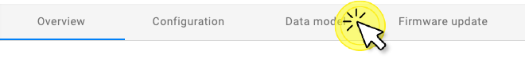

# Quick Start

## Welcome to the DevZone of AVSystem!

This Quick Start walks you through the process of building your first LwM2M application using AVSystem’s LwM2M Client **Anjay** and AVSystem’s LwM2M Server **Coiote IoT Device Management**.

Follow this guide to build your first LwM2M application using a simulated device within 20 minutes.

## Access the Coiote IoT DM portal

Get started by <a href="https://eu.iot.avsystem.cloud/" target="_blank">**signing up**</a> to Coiote IoT Device Management. You can sign up for a developer account, which allows you to connect up to 10 devices free of charge.

[Coiote IoT DM](https://eu.iot.avsystem.cloud/){: .md-button .md-button--big }


*Empty device inventory at Coiote IoT DM*

## Run Anjay LwM2M Client Demo

Anjay LwM2M SDK is a set of tools that enables device vendors and IoT developers to easily implement a LwM2M client on their hardware. It is available both in an advanced commercial version as well as in the open-source model you can find on <a href="https://github.com/AVSystem/Anjay" target="_blank">GitHub</a>.

Start by running the Anjay client on your **Linux**, **Mac** or **Windows** machine and simulate LwM2M telemetry data.

!!! note
    If preferred, you can directly jump to the Getting Started guides of the popular hardware platforms:

    * [Nordic](LwM2M_Client/Nordic/Thingy91/)
    * [STMicroelectronics](LwM2M_Client/STMicroelectronics/Building_LwM2M_applications/Building_LwM2M_applications_with_I-CUBE-Anjay/), 
    * [ESP32](LwM2M_Client/ESP32/M5Stick/) 
    * [Raspberry Pi](Anjay_integrations/RaspberryPi_integration/RaspberryPi-Pico-W/)


!!! Info
    For more information about the Anjay LwM2M Client, visit the <a href="https://avsystem.github.io/Anjay-doc/index.html" target="_blank">**Anjay Library Documentation**</a>.


### Compile the Anjay demo client:

=== "Linux"
    Open up your command line interface and install the required dependencies:

    ```
    sudo apt-get install git build-essential cmake libmbedtls-dev zlib1g-dev
    ```

    Create a new directory, e.g. called `AVSystem`:

    ```
    mkdir ~/AVSystem \
        && cd AVSystem
    ```

    Clone the Anjay GitHub repository and compile the Anjay demo client using Cmake:

    ```
    git clone https://github.com/AVSystem/Anjay.git \
        && cd Anjay \
        && git submodule update --init \
        && cmake . \
        && make -j
    ```

=== "Mac"
    Open up your terminal and install the required dependencies using [Homebrew](https://brew.sh/):

    ```
    brew install cmake mbedtls
    ```

    Create a new directory, e.g. called `AVSystem`:

    ```
    mkdir ~/AVSystem \
        && cd AVSystem
    ```

    Clone the Anjay GitHub repository and compile the Anjay demo client using Cmake:

    ```
    git clone https://github.com/AVSystem/Anjay.git \
        && cd Anjay \
        && git submodule update --init \
        && cmake . \
        && make -j
    ```

=== "Windows"
    **Install the required dependencies**

    1. Install [MSYS2](http://www.msys2.org/)
    
    1. Install [Git for Windows](https://gitforwindows.org/)
    
        !!! Note 
            You can also install these using [Chocolatey](https://chocolatey.org/): `choco install git msys2` but make sure to follow the instructions to update MSYS2 after installing it.
    
    1. Open the appropriate MINGW shell (e.g., `C:\msys64\mingw32.exe` or `C:\msys64\mingw64.exe`, depending on whether you want to build 32- or 64-bit binaries) and install the compile-time dependencies:

        ```
        pacman -Sy make ${MINGW_PACKAGE_PREFIX}-gcc ${MINGW_PACKAGE_PREFIX}-cmake ${MINGW_PACKAGE_PREFIX}-mbedtls
        ```

    **Compile the project**

    Run the following commands in the MINGW shell, after navigating to the directory created using Git above:

    ```
    cmake -G"MSYS Makefiles" -DDTLS_BACKEND="mbedtls" .
    make
    ```

## Add a new device in Coiote IoT DM

After compiling the demo project, go back to the [Coiote IoT DM portal](https://eu.iot.avsystem.cloud/).

Click **+ Add device** in the top-right corner.


Add a new device using the option: **Anjay LwM2M Client Demo**


Copy the command you find in Coiote.


Go back to your terminal, open your Anjay directory and **run the command** to configure and activate the demo application.

## Monitor your demo device in the Coiote IoT DM

If the demo application started successfully, a device is shown in the Coiote platform.


### Review the Data model

Go to the **Data model** tab in the top-menu.



Under Data model you will find all the configured LwM2M **Objects**, **Object instances** and **Resources** containing property values or telemetry data. This includes:

- Object `/1 LwM2M`
    - Resource `/0 Short Server ID`
    - Resource `/1 Lifetime`
    - Etc.
- Object `/3 Device`
    - Resource `/0 Manufacturer`
    - Resource `/1 Modem Number`
    - Resource `/2 Serial Number`
    - Etc.
- Object `/6 Location`
    - Resource `/0 Latitude`
    - Resource `/1 Longitude`
    - Resource `/2 Altitude`
    - Etc.
- Object `/3303 Temperature`
    - Resource `/5601 Min Measured Value`
    - Resource `/5602 Max Measured Value`
    - Resource `/5700 Sensor Value`
    - Etc.


## Next steps

Did you manage to run the Anjay LwM2M Client Demo? **Well done! 👏**

Now the fun begins. Below you can find useful links to continue your LwM2M journey.

### Get started with popular hardware platforms

Follow the getting started guides to kickstart your LwM2M application using one of the popular hardware platforms: [Nordic](LwM2M_Client/Nordic/Thingy91/), [STMicroelectronics](LwM2M_Client/STMicroelectronics/Building_LwM2M_applications/Building_LwM2M_applications_with_I-CUBE-Anjay/), [ESPRESSIF](LwM2M_Client/ESP32/M5Stick/) or [Raspberry Pi](Anjay_integrations/RaspberryPi_integration/RaspberryPi-Pico-W/).

[](LwM2M_Client/Nordic/Thingy91/)
[](LwM2M_Client/STMicroelectronics/Building_LwM2M_applications/Building_LwM2M_applications_with_I-CUBE-Anjay/)
[](LwM2M_Client/ESP32/M5Stick/)
[](Anjay_integrations/RaspberryPi_integration/RaspberryPi-Pico-W/)

### Learn more about Coiote IoT DM

Dive into Coiote IoT Device Management and explore its numerous functionalities. From device onboarding using the [Bootstrapping Server](Coiote_IoT_DM/User_Interface/Device_onboarding/) to [Data Visualization](Coiote_IoT_DM/Quick_Start/Visualize_device_data/) and running automated [Device Tests](Coiote_IoT_DM/Device_tests/Overview/).

[Coiote IoT DM docs](Coiote_IoT_DM/Quick_Start/Connect_device_quickstart/){: .md-button .md-button--big }

### Join our community on Discord

Join us on <a href="https://discord.avsystem.com/" target="_blank">Discord</a> to get in touch with AVSystem experts and to meet fellow LwM2M developers.

<a href="https://discord.avsystem.com/" target="_blank">

</a>


