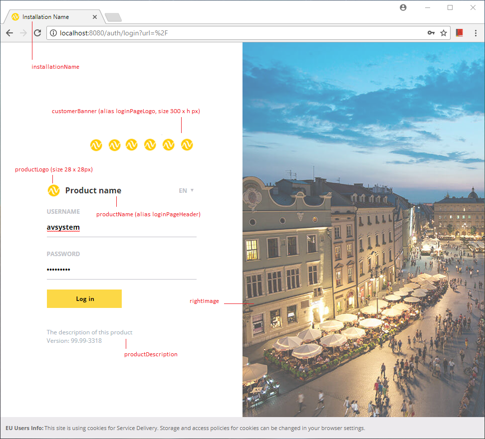
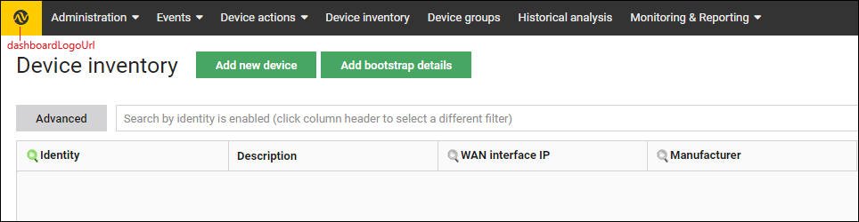
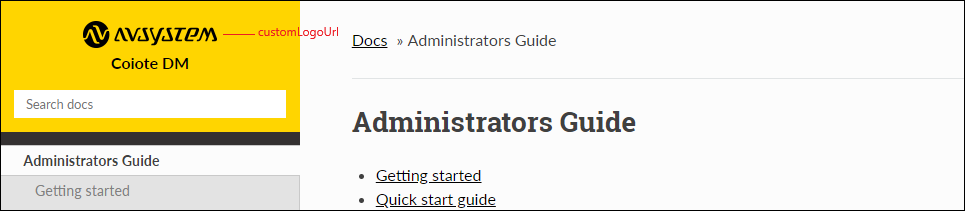

.. _Login_Page_Customization:

########################
Login Page Customization
########################

You can customise your login page using the following properties in the ``cdm.conf`` file:

.. code-block:: bash

   smg.mod.dashboard {
       installationName = Installation Name                      #displayed on the page tab in the browser
       favicon = STATIC/loginPage/images/favicon.ico             #displayed on the page tab in the browser
       productName = Product name                                #displayed above the login form
       productLogo = STATIC/loginPage/images/logo.png            #image path, 28 x 28 px, displayed next to the product name
       productDescription = The description of this product      #displayed below the login form, above the version info
       customerBanner = STATIC/loginPage/images/banner.png       #image path, 300 x h px (0 < h <= 200), displayed above the product name
       rightImage = STATIC/loginPage/images/rightSide.png        #image on the right of the login page
       dashboardLogoUrl = STATIC/loginPage/images/my_logo.png    #image path, 30 x 130 px, displayed in the left upper corner of the platform interface 
   }

The images below present the arrangement of these properties:

Also, you can customise the logo image displayed in the documentation page via the following ``cdm.conf`` file property:

.. code-block:: bash

  smg.mod.documentation {
       customLogoUrl = /STATIC/loginPage/images/clientLogo/my_logo_docs.jpg    #image path displayed in the left upper corner of the documentation page 
   }

